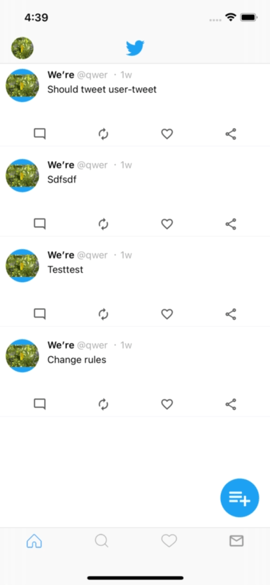

# Twitter
hello, I'm Roger, an IOS Developer
This project is practicing to make complete twitter using MVVM Design Patterns.

## Environment
* Xcode 13.3 +
* Snapkit package
* Firebase/Core
* Firebase/Database
* Firebase/storage
* Firebase/Auth
* SDWebImage

## Features structure
* Use MVVM Framework
* Auto-layout and programmatic UI skills
* Fully functioning social network
* UITableView and UICollectionView skills
* Backend development and architecture skills using Firebase
* Register and authenticate users using Firebase
* Swift techniques and architecture patterns
* Advanced UI/UX development to build a clean and visually appearing user interface
* Implement Hashtags & Mentions

## Demo

